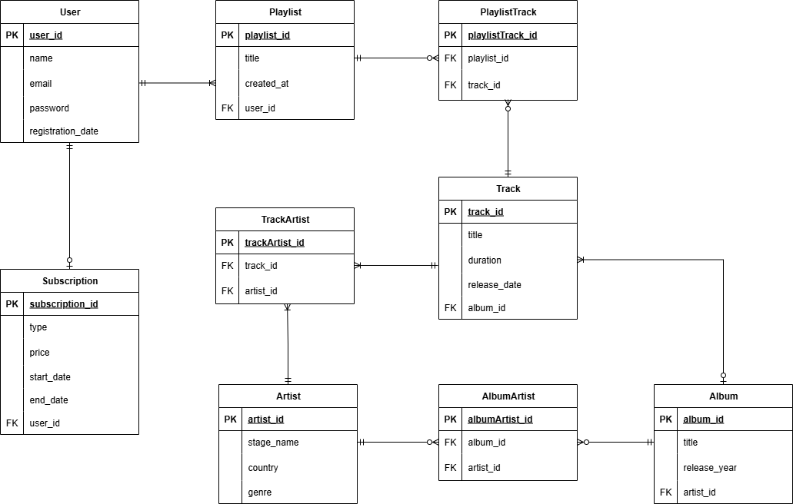

# Лабораторна робота: Проєктування ER-діаграми бази даних для музичного додатку

## 1. Короткий виклад вимог

### Потреби зацікавлених сторін

- Користувачі повинні мати можливість створювати облікові записи, створювати власні плейлисти та додавати до них треки.
- Система має зберігати інформацію про виконавців, альбоми, треки та користувачів.
- Повинна бути підтримка підписок різних типів (наприклад, преміум, преміум+).
- Користувач може мати лише одну активну підписку одночасно.

### Дані для зберігання

- Дані користувачів (ім’я, email, пароль, дата реєстрації).
- Дані про підписки (тип, ціна, дати початку та закінчення).
- Дані про плейлисти та їхній вміст (назва, дата створення, треки).
- Інформація про треки (назва, тривалість, дата релізу).
- Інформація про альбоми та виконавців.

### Бізнес-правила

- Один користувач може мати багато плейлистів.
- Кожен плейлист може містити багато треків, а один трек може входити до кількох плейлистів.
- Один виконавець може мати багато альбомів і брати участь у записі кількох треків.
- Один трек може належати одному альбому, але мати кількох виконавців.
- Користувач може мати лише одну активну підписку.

---

## 2. ER-Діаграма

---

## 3. Опис сутностей та зв’язків

### **User (Користувач)**

**Атрибути:**

- `user_id` — унікальний ідентифікатор користувача (PK)
- `name` — ім’я користувача
- `email` — адреса електронної пошти
- `password` — пароль
- `registration_date` — дата реєстрації

**Зв’язки:**

- 1 до 1..M з `Playlist` — один користувач може мати кілька плейлистів.
- 1 до 0..1 з `Subscription` — один користувач має одну активну підписку.

---

### **Subscription (Підписка)**

**Атрибути:**

- `subscription_id` — унікальний ідентифікатор підписки (PK)
- `type` — тип підписки
- `price` — ціна
- `start_date`, `end_date` — період дії
- `user_id` — зовнішній ключ до користувача

**Зв’язки:**

- 0..1 до 1 з `User` — підписка належить певному користувачу.

---

### **Playlist (Плейлист)**

**Атрибути:**

- `playlist_id` — унікальний ідентифікатор плейлиста (PK)
- `title` — назва плейлиста
- `created_at` — дата створення
- `user_id` — користувач, який створив плейлист (FK)

**Зв’язки:**

- 1..M до 1 з `User`
- 1 до 0..M з `PlaylistTrack`.

---

### **PlaylistTrack (Зв’язок між Playlist і Track)**

**Атрибути:**

- `playlistTrack_id` — унікальний ідентифікатор (PK)
- `playlist_id` — зовнішній ключ до плейлиста
- `track_id` — зовнішній ключ до треку

**Зв’язки:**

- 0..M до 1 з `Playlist`
- 0..M до 1 з `Track`.

---

### **Track (Трек)**

**Атрибути:**

- `track_id` — унікальний ідентифікатор треку (PK)
- `title` — назва треку
- `duration` — тривалість
- `release_date` — дата випуску
- `album_id` — зовнішній ключ до альбому

**Зв’язки:**

- 1..M до 0..1 з `Album`
- 1 до 1..M з `TrackArtist`
- 1 до 0..M з `PlaylistTrack`.

---

### **Artist (Виконавець)**

**Атрибути:**

- `artist_id` — унікальний ідентифікатор виконавця (PK)
- `stage_name` — сценічне ім’я
- `country` — країна
- `genre` — жанр

**Зв’язки:**

- 1 до 1..M з `TrackArtist`
- 1 до 0..M з `AlbumArtist`.

---

### **TrackArtist (Зв’язок між Track і Artist)**

**Атрибути:**

- `trackArtist_id` — унікальний ідентифікатор (PK)
- `track_id` — зовнішній ключ до треку
- `artist_id` — зовнішній ключ до виконавця

**Зв’язки:**

- 1..M до 1 з `Track`
- 1..M до 1 з `Artist`.

---

### **Album (Альбом)**

**Атрибути:**

- `album_id` — унікальний ідентифікатор альбому (PK)
- `title` — назва альбому
- `release_year` — рік випуску
- `artist_id` — основний виконавець альбому (FK)

**Зв’язки:**

- 0..1 до 1..M з `Track`
- 1 до 0..M з `AlbumArtist`.

---

### **AlbumArtist (Зв’язок між Album і Artist)**

**Атрибути:**

- `albumArtist_id` — унікальний ідентифікатор (PK)
- `album_id` — зовнішній ключ до альбому
- `artist_id` — зовнішній ключ до виконавця

**Зв’язки:**

- 0..M до 1 з `Album`
- 0..M до 1 з `Artist`.

---

## 4. Припущення та обмеження

- Один користувач може мати лише **одну активну підписку** одночасно.
- Один плейлист може містити **будь-яку кількість треків**.
- Один трек належить лише **одному альбому** (а може бути й сінглом), але може виконуватись **кількома артистами**.
- Кожен артист може брати участь у записі **декількох альбомів і треків**.
- Система не зберігає інформацію про прослуховування треків (це поза межами поточної моделі).

---
