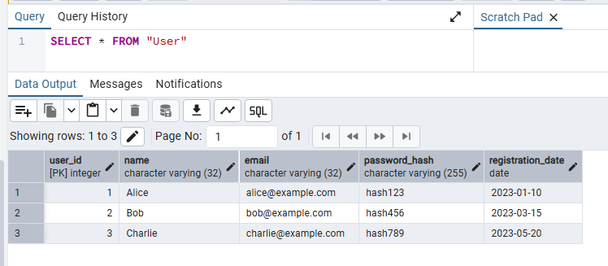
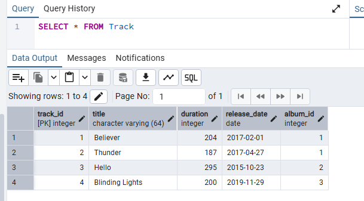
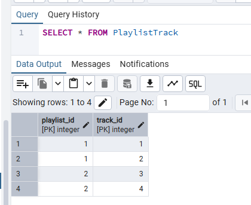
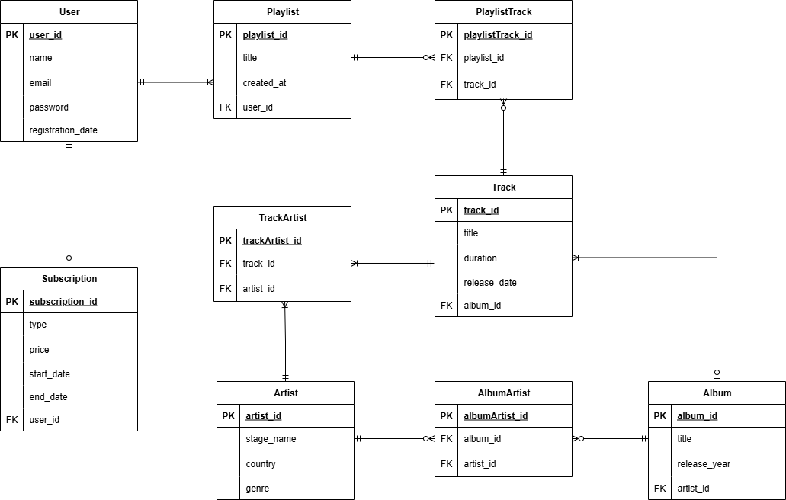

# 🎵 База даних

## 1. Опис проєкту

Ця база даних моделює структуру музичного застосунку, в якому користувачі можуть:

- слухати треки, альбоми й виконавців,
- створювати власні плейлисти,
- оформлювати підписки різних типів.

---

## 2. Структура бази даних

### Таблиця **Artist**

| Поле       | Тип                | Опис                               |
| ---------- | ------------------ | ---------------------------------- |
| artist_id  | SERIAL PRIMARY KEY | Унікальний ідентифікатор виконавця |
| stage_name | VARCHAR(64)        | Сценічне ім’я                      |
| country    | VARCHAR(32)        | Країна походження                  |
| genre      | VARCHAR(32)        | Музичний жанр                      |

---

### Таблиця **Album**

| Поле         | Тип                | Опис                                                           |
| ------------ | ------------------ | -------------------------------------------------------------- |
| album_id     | SERIAL PRIMARY KEY | Ідентифікатор альбому                                          |
| title        | VARCHAR(64)        | Назва альбому                                                  |
| release_year | INT                | Рік випуску (≥ 1900)                                           |
| artist_id    | INT                | Зовнішній ключ → `Artist(artist_id)`   Видаляється каскадно |

---

### Таблиця **Track**

| Поле         | Тип                | Опис                                                      |
| ------------ | ------------------ | --------------------------------------------------------- |
| track_id     | SERIAL PRIMARY KEY | Ідентифікатор треку                                       |
| title        | VARCHAR(64)        | Назва треку                                               |
| duration     | INT                | Тривалість у секундах                                     |
| release_date | DATE               | Дата випуску                                              |
| album_id     | INT                | Зовнішній ключ → `Album(album_id)`   ON DELETE CASCADE |

---

### Таблиця **User**

| Поле              | Тип                | Опис                      |
| ----------------- | ------------------ | ------------------------- |
| user_id           | SERIAL PRIMARY KEY | Ідентифікатор користувача |
| name              | VARCHAR(32)        | Ім’я користувача          |
| email             | VARCHAR(32) UNIQUE | Електронна пошта          |
| password_hash     | VARCHAR(255)       | Хешований пароль          |
| registration_date | DATE               | Дата реєстрації           |

---

### Таблиця **Playlist**

| Поле        | Тип                | Опис                                                    |
| ----------- | ------------------ | ------------------------------------------------------- |
| playlist_id | SERIAL PRIMARY KEY | Ідентифікатор плейлиста                                 |
| title       | VARCHAR(64)        | Назва плейлиста                                         |
| created_at  | DATE               | Дата створення                                          |
| user_id     | INT                | Зовнішній ключ → `User(user_id)`   ON DELETE CASCADE |

---

### Таблиця **PlaylistTrack**

| Поле                                    | Тип | Опис                                         |
| --------------------------------------- | --- | -------------------------------------------- |
| playlist_id                             | INT | Зовнішній ключ → `Playlist(playlist_id)`     |
| track_id                                | INT | Зовнішній ключ → `Track(track_id)`           |
| **PRIMARY KEY** (playlist_id, track_id) |     | Багато-до-багатьох між плейлистами і треками |

---

### Таблиця **SubscriptionType**

| Поле    | Тип                | Опис                             |
| ------- | ------------------ | -------------------------------- |
| type_id | SERIAL PRIMARY KEY | Ідентифікатор типу підписки      |
| name    | VARCHAR(32)        | Назва підписки (No Ads, Premium) |
| price   | DECIMAL(6,2)       | Ціна (до 9999.99)                |

---

### Таблиця **Subscription**

| Поле            | Тип                | Опис                                                    |
| --------------- | ------------------ | ------------------------------------------------------- |
| subscription_id | SERIAL PRIMARY KEY | Ідентифікатор підписки                                  |
| type_id         | INT                | Зовнішній ключ → `SubscriptionType(type_id)`            |
| start_date      | DATE               | Дата початку                                            |
| end_date        | DATE               | Може бути `NULL`, якщо активна                          |
| user_id         | INT                | Зовнішній ключ → `User(user_id)`   ON DELETE CASCADE |

---

### Таблиця **TrackArtist**

| Поле                                  | Тип | Опис                                         |
| ------------------------------------- | --- | -------------------------------------------- |
| track_id                              | INT | Зовнішній ключ → `Track(track_id)`           |
| artist_id                             | INT | Зовнішній ключ → `Artist(artist_id)`         |
| **PRIMARY KEY** (track_id, artist_id) |     | Багато-до-багатьох між треками і виконавцями |

---

### Таблиця **AlbumArtist**

| Поле                                  | Тип | Опис                                           |
| ------------------------------------- | --- | ---------------------------------------------- |
| album_id                              | INT | Зовнішній ключ → `Album(album_id)`             |
| artist_id                             | INT | Зовнішній ключ → `Artist(artist_id)`           |
| **PRIMARY KEY** (album_id, artist_id) |     | Багато-до-багатьох між альбомами і виконавцями |

---

## 3. Основні зв’язки

- Один **Artist** може мати кілька **Album**.
- Один **Album** може містити кілька **Track**.
- Один **User** може мати кілька **Playlist** і одну **Subscription**.
- **Playlist** може містити багато **Track**, і один **Track** може бути в кількох плейлистах (через таблицю `PlaylistTrack`).
- Зв’язки "багато-до-багатьох" реалізовані через допоміжні таблиці (`PlaylistTrack`, `TrackArtist`, `AlbumArtist`).

---

## 4. Важливі припущення

- Дата закінчення підписки `end_date` може бути `NULL`, якщо підписка активна.
- Усі зовнішні ключі мають правило **ON DELETE CASCADE**, щоб забезпечити автоматичне видалення залежних записів.
- Поле `release_year` у таблиці `Album` має обмеження `CHECK (release_year >= 1900)`.
- Значення `price` у таблиці `SubscriptionType` зберігається у форматі `DECIMAL(6,2)` (наприклад, `9.99`).

---

## 5. Приклади даних

---

---

---

## 6. ER-діаграма

