# Звіт з Лабораторної роботи №4

**Тема:** Аналітичні SQL-запити (OLAP)

---

#### Запит 1.

Отримання зведеної інформації про тривалість треків.

- **Опис:** Обчислення загальної кількості треків, середньої тривалості, а також пошук найкоротшого та найдовшого треку в бібліотеці

```sql
SELECT
    COUNT(*) AS total_tracks,
    AVG(duration_seconds) AS avg_duration_sec,
    MIN(duration_seconds) AS min_duration_sec,
    MAX(duration_seconds) AS max_duration_sec
FROM Track;
```


.png>)

#### Запит 2.

Підрахунок кількості артистів у кожній країні.

- **Опис:** Дозволяє проаналізувати географію виконавців у базі даних.

```sql
SELECT country, COUNT(*) AS artist_count
FROM Artist
GROUP BY country
ORDER BY artist_count DESC;
```

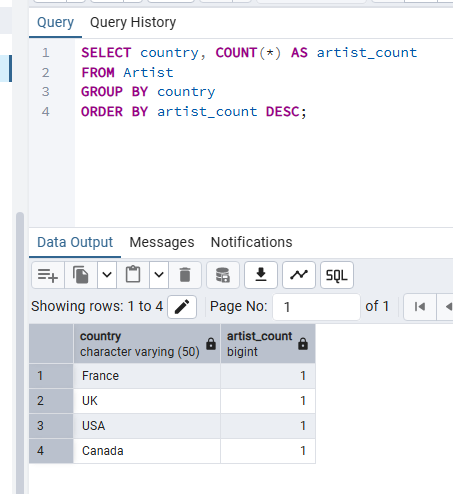

#### Запит 3.

Підрахунок кількості підписників для кожного типу підписки.

- **Опис:** Бізнес-метрика, що показує, які тарифи користуються найбільшим попитом.

```sql
SELECT type_id, COUNT(*) AS subscribers_count
FROM Subscription
GROUP BY type_id
ORDER BY subscribers_count ASC;
```

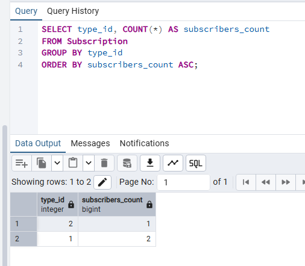

#### Запит 4.

Пошук альбомів, які містять менше 4-х треків.

- **Опис:** Використовується для знаходження "маленьких" релізів. Спочатку треки групуються за альбомом, потім `COUNT` рахує їх кількість, а `HAVING` відсіює ті групи, де треків 4 або більше.

```sql
SELECT album_id, COUNT(*) AS track_count
FROM Track
WHERE album_id IS NOT NULL
GROUP BY album_id
HAVING COUNT(*) < 4;
```

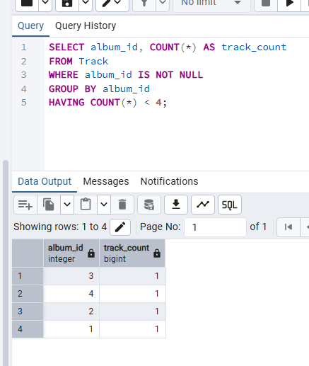

#### Запит 5.

Виведення назви синглу разом з іменем виконавця.

- **Опис:** Використовується INNER JOIN для з'єднання трьох таблиць (Track -> TrackArtist -> Artist). У результат потрапляють тільки ті треки, які мають прив'язаного виконавця (повні пари).

```sql
SELECT T.title AS track_title, A.stage_name AS artist_name
FROM Track T
INNER JOIN TrackArtist TA ON T.track_id = TA.track_id
INNER JOIN Artist A ON TA.artist_id = A.artist_id
ORDER BY T.title;
```

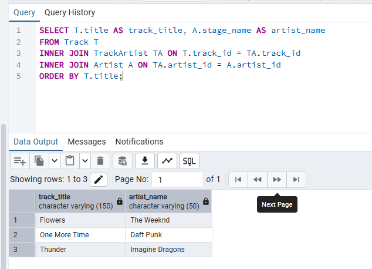

#### Запит 6.

Виведення всіх треків та назв їхніх альбомів.

- **Опис:** Використовується LEFT JOIN. Це дозволяє вивести всі пісні, навіть якщо вони є синглами. У таких випадках у колонці альбому виводиться NULL.

```sql
SELECT T.title AS track_title, AL.title AS album_title
FROM Track T
LEFT JOIN Album AL ON T.album_id = AL.album_id;
```

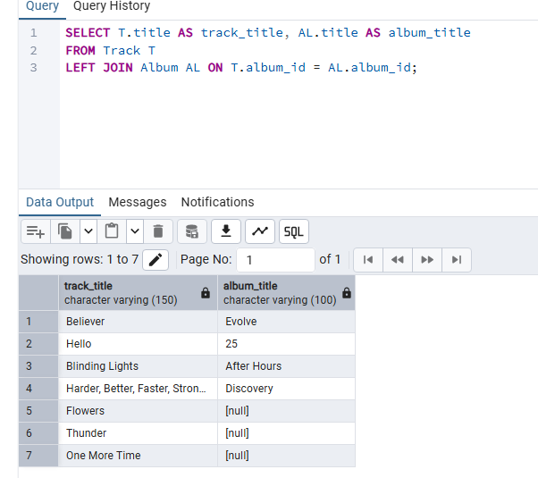

#### Запит 7.

Генерація матриці "Користувач — Тип підписки".

- **Опис:** Створює список усіх можливих комбінацій користувачів і тарифів, незалежно від реальних покупок.

```sql
SELECT U.name AS user_name, S.name AS subscription_plan
FROM "User" U
CROSS JOIN SubscriptionType S;
```

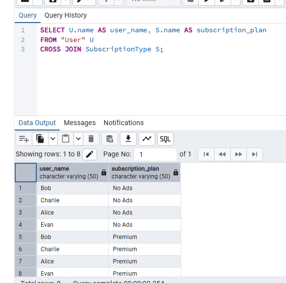

#### Запит 8.

Пошук треків, довших за середнє значення.

- **Опис:** Спочатку внутрішній запит обчислює середню тривалість (AVG) по всій таблиці, а потім зовнішній запит використовує це число для фільтрації.

```sql
SELECT title, duration_seconds
FROM Track
WHERE duration_seconds > (SELECT AVG(duration_seconds) FROM Track);
```

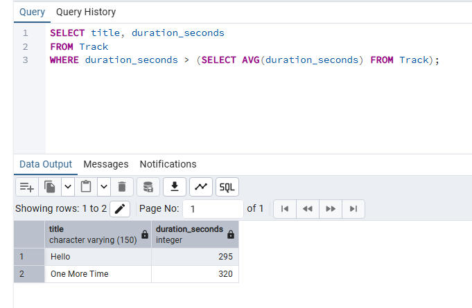

#### Запит 9.

Підрахунок плейлістів для кожного користувача.

- **Опис:** Замість GROUP BY, для кожного рядка таблиці User виконується окремий підзапит, що рахує кількість плейлістів цього конкретного користувача.

```sql
SELECT name,
    (SELECT COUNT(*) FROM Playlist WHERE Playlist.user_id = "User".user_id) AS playlist_count
FROM "User";
```

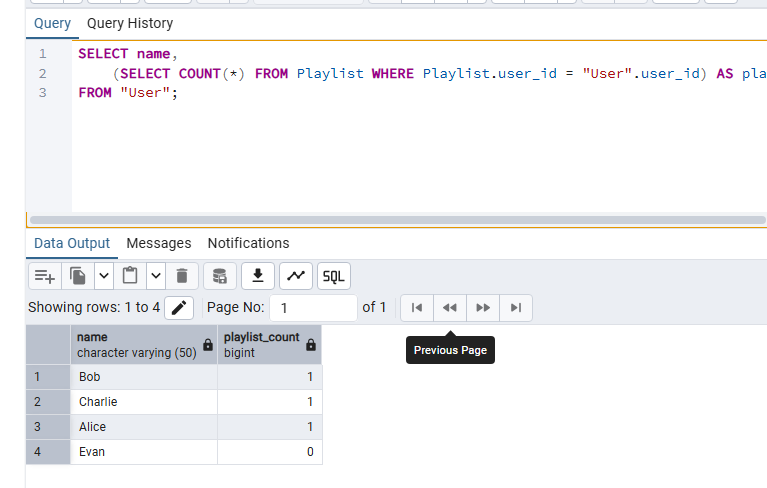

#### Запит 10.

Пошук артистів, що випускали альбоми до 2016 року.

- **Опис:** Використовується ланцюжок вкладених запитів: Album (знаходить старі альбоми) -> AlbumArtist (знаходить ID авторів) -> Artist (виводить імена).

```sql
SELECT stage_name
FROM Artist
WHERE artist_id IN (
    SELECT artist_id
    FROM AlbumArtist
    WHERE album_id IN (
         SELECT album_id FROM Album WHERE release_year < 2016
    )
);
```

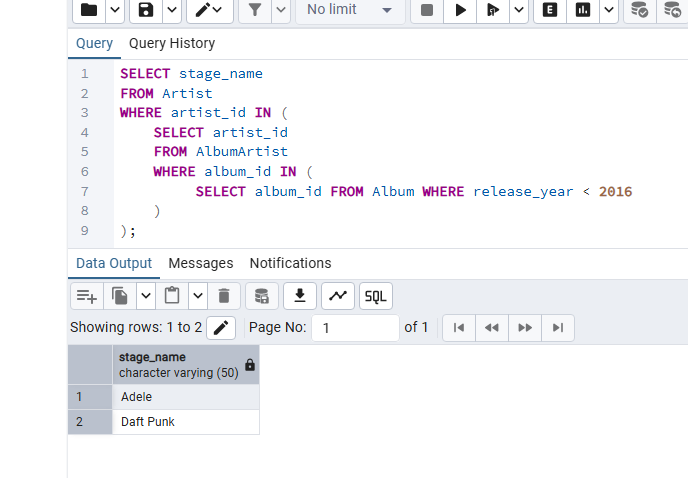

#### Запит 11.

Розрахунок виручки по кожному тарифу.

- **Опис:** Запит з'єднує типи підписок з реальними підписками, групує їх за назвою тарифу та підсумовує ціну (SUM) для розрахунку загального прибутку.

```sql
SELECT ST.name AS plan_name,
       COUNT(S.subscription_id) AS total_subscribers,
       SUM(ST.price) AS total_revenue
FROM SubscriptionType ST
JOIN Subscription S ON ST.type_id = S.type_id
GROUP BY ST.name;
```

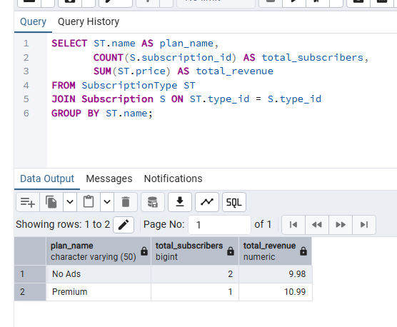

#### Запит 12.

Загальна тривалість музики в плейлістах користувачів.

- **Опис:** Запит, що об'єднує 4 таблиці (User -> Playlist -> PlaylistTrack -> Track). Він дозволяє побачити, хто з користувачів зібрав найбільшу колекцію музики (у секундах).

```sql
SELECT U.name AS user_name,
       SUM(T.duration_seconds) AS total_music_seconds
FROM "User" U
JOIN Playlist P ON U.user_id = P.user_id
JOIN PlaylistTrack PT ON P.playlist_id = PT.playlist_id
JOIN Track T ON PT.track_id = T.track_id
GROUP BY U.name
ORDER BY total_music_seconds DESC;
```

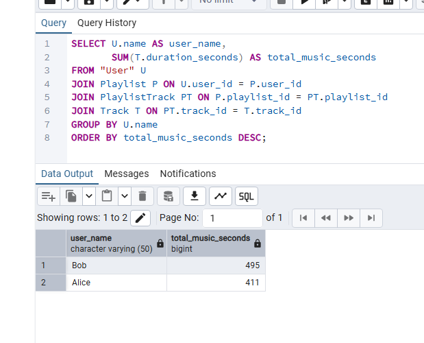
