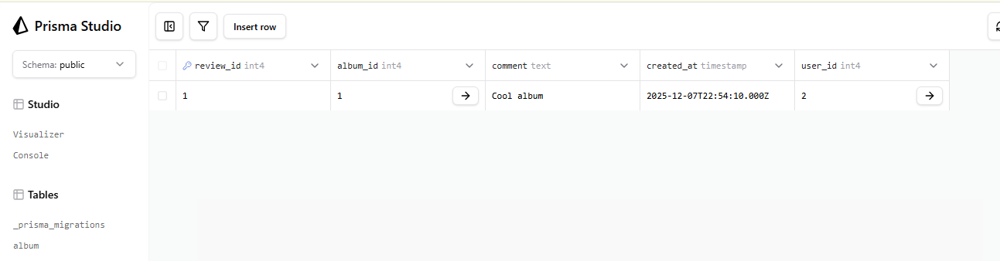
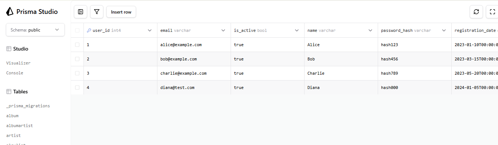
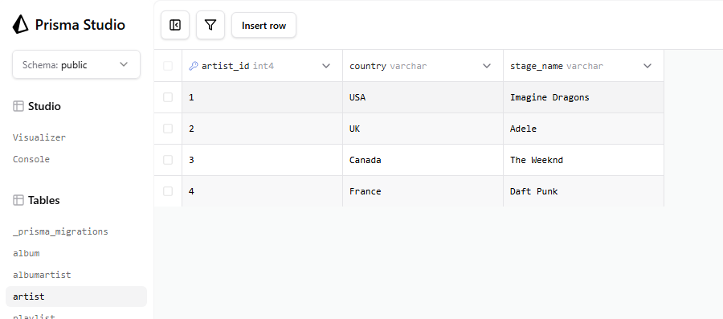

# Звіт Prisma (Лабораторна 6)

## 1. Міграція: `add-review-table`

**Опис:** Додано нову модель `Review` для зберігання відгуків користувачів про альбоми. Реалізовано зв'язки "один-до-багатьох" з моделями `User` та `album`.

**Зміни в `schema.prisma` (Фрагмент `Review`):**

```prisma
// Нова модель 
model Review {
  review_id  Int      @id @default(autoincrement())\
  rating     Int
  comment    String?
  created_at DateTime @default(now())
  user_id    Int
  album_id   Int
  album      album    @relation(fields: [album_id], references: [album_id], onDelete: Cascade)
  User       User     @relation(fields: [user_id], references: [user_id], onDelete: Cascade)
}

// Оновлення існуючих моделей (додано зворотні поля)
model User {
  // ...
  reviews Review[]
}

model album {
  // ...
  reviews Review[]
}
```

**Згенерований `migration.sql`:**

```sql
-- CreateTable
CREATE TABLE "Review" (
    "review_id" SERIAL NOT NULL,
    "rating" INTEGER NOT NULL,
    "comment" TEXT,
    "created_at" TIMESTAMP(3) NOT NULL DEFAULT CURRENT_TIMESTAMP,
    "user_id" INTEGER NOT NULL,
    "album_id" INTEGER NOT NULL,

    CONSTRAINT "Review_pkey" PRIMARY KEY ("review_id")
);

-- AddForeignKey
ALTER TABLE "Review" ADD CONSTRAINT "Review_user_id_fkey" FOREIGN KEY ("user_id") REFERENCES "User"("user_id") ON DELETE CASCADE ON UPDATE CASCADE;

-- AddForeignKey
ALTER TABLE "Review" ADD CONSTRAINT "Review_album_id_fkey" FOREIGN KEY ("album_id") REFERENCES "album"("album_id") ON DELETE CASCADE ON UPDATE CASCADE;
```

## 2. Міграція: `add_is_active_to_user`

**Опис:** До таблиці `User` додано нове логічне поле `is_active` зі значенням за замовчуванням `true`. Це поле дозволяє реалізувати "м'яке видалення" або блокування користувачів.

**Зміни в `schema.prisma` (Фрагмент `User`):**

```prisma
model User {
  user_id           Int            @id @default(autoincrement())
  name              String         @db.VarChar(50)
  email             String         @unique @db.VarChar(255)
  password_hash     String         @db.VarChar(255)
  registration_date DateTime       @default(dbgenerated("CURRENT_DATE")) @db.Date
  is_active         Boolean        @default(true)
  reviews           Review[]
  playlist          playlist[]
  subscription      subscription[]
}
```

**Згенерований `migration.sql`:**

```sql
-- AlterTable
ALTER TABLE "User" ADD COLUMN     "is_active" BOOLEAN NOT NULL DEFAULT true;
```

## 3. Міграція: `drop_artist_genre`

**Опис:** Видалено стовпець `genre` з таблиці `artist`. Це зроблено в рамках оптимізації схеми (жанри можуть бути винесені в окрему сутність у майбутньому).

**Зміни в `schema.prisma` (Фрагмент `artist`):**

```prisma
model artist {
  artist_id   Int           @id @default(autoincrement())
  stage_name  String        @unique @db.VarChar(50)
  country     String?       @db.VarChar(50)
  albumartist albumartist[]
  trackartist trackartist[]
}
```

**Згенерований `migration.sql`:**

```sql
-- AlterTable
ALTER TABLE "artist" DROP COLUMN "genre";

```

## 4. Міграція: `drop_review_rating`

**Опис:** Видалено стовпець `rating` з таблиці `review`.

**Зміни в `schema.prisma` (Фрагмент `review`):**

```prisma
model Review {
  review_id  Int      @id @default(autoincrement())
  comment    String?
  created_at DateTime @default(now())
  user_id    Int
  album_id   Int
  album      album    @relation(fields: [album_id], references: [album_id], onDelete: Cascade)
  User       User     @relation(fields: [user_id], references: [user_id], onDelete: Cascade)
}
```

**Згенерований `migration.sql`:**

```sql
-- AlterTable
ALTER TABLE "Review" DROP COLUMN "rating";

```

## 4. Перевірка результатів за допомогою Prisma Studio

## Докази коректності схеми та запитів:

## 1. Перевірка таблиці `Review` та зв'язку

У Prisma Studio успішно створено новий запис у таблиці `Review`, що підтверджує, що міграція `add-review-table `була успішною і зовнішній ключ `album_id` працює. Також стовпець `rating` відсутній.



## 2. Перевірка зміни таблиці `User`

У таблиці `User` перевірено наявність нового стовпця `is_active` та його значення за замовчуванням.



## 3. Перевірка видалення стовпця `genre`

Перевірка моедлі `artist`: стовпець `genre` відсутній, що підтвердує успішність міграції `drop_artist_genre`.

